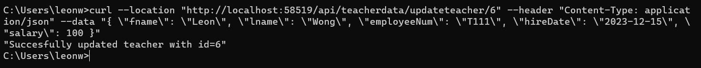

# Readme

# Initiative done for cumulative 3

1. Client side validation is used in teacher.js with the validateInput function
2. Server side validation is used on the Teacher class with the isValid function.
3. Ajax is used to update teacher. There is two button created on the Show.cshtml, one for MVC pattern and one for Ajax pattern.
4. Used curl to test the update teacher api.(path: "./csharp-cumulative3.png")
   
